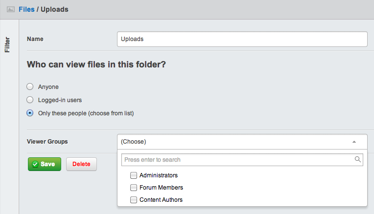
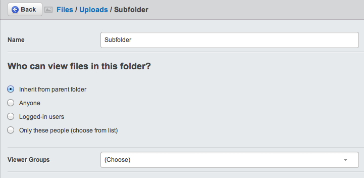

title: Securing files
summary: How to secure files inside the Files and Images area

# Securing files

## In this section:

* Assigning folder permissions
* Permission considerations

## Before we begin:

* Make sure you have the SilverStripe [secure assets](http://addons.silverstripe.org/add-ons/silverstripe/secureassets) module installed

The secure assets module can be used to apply security restrictions to
the Files and Images area on a folder by folder basis.

## Assigning permissions

To edit permissions for a folder go to the Files section of the cms and select
the edit icon beside the folder to apply permissions to. The root 'assets'
folder itself may not be given permissions directly, so only store restricted
content in a secure subfolder instead.

### Default Folder Permissions

The following permissions are available for every folder:

 * `Anyone` - All read - write access is allowed. This is the default value.
 * `Logged-in users` - Only registered users
 * `Only these people` - Allows specific groups to be selected

### Subfolders

For folders at the third level or deeper (e.g. assets/Uploads/Subfolder)
the default value is instead `Inherit`, which will use the same
permissions as the folder above.

As a matter of best practice it is advisable to avoid giving a subfolder
less restrictive permissions than the one above, as users may find
it difficult to access in the CMS.

## Permission considerations

Files will inherit the permissions of the folder they are placed in, but
may not have permissions assigned directly. This is due to the restriction
on permissions being placed on a per-folder level.

Pages may be created in draft with secure files attached, but when this page is
published you will need to change the permissions on each file to make them accessible.

Try to avoid attaching secure images or other files to live pages (or other DataObjects)
which may be publicly viewed, to avoid unnecessary access denied errors appearing.